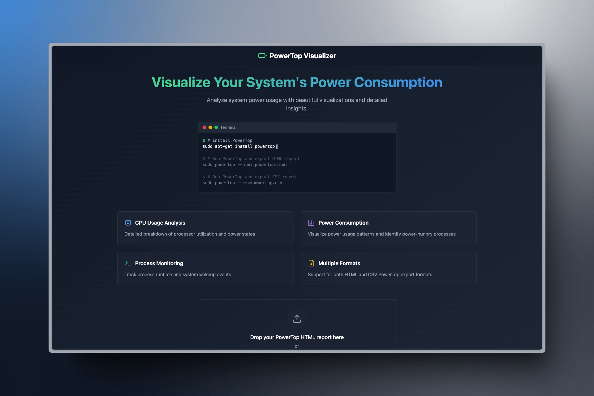

# PowerTop Visualizer

PowerTop Visualizer is a web-based tool that helps you analyze and visualize power consumption data from PowerTop reports. It provides beautiful visualizations and detailed insights into your system's power usage, CPU states, and process activities.



## Features

- 📊 **CPU Usage Analysis**: Detailed breakdown of processor utilization and power states.
- ⚡ **Power Consumption**: Visualize power usage patterns and identify power-hungry processes.
- 🖥️ **Process Monitoring**: Track process runtime and system wakeup events.
- 📁 **Multiple Formats**: Support for both HTML and CSV PowerTop export formats.

## Getting Started

### Prerequisites

- Node.js (v16 or higher)
- npm or yarn
- PowerTop installed on your Linux system

### Installation

1. Clone the repository:
   ```bash
   git clone https://github.com/yourusername/powertop-visualizer.git
   cd powertop-visualizer
   ```

2. Install dependencies:
   ```bash
   npm install
   ```
   or
   ```bash
   yarn install
   ```

3. Start the development server:
   ```bash
   npm run dev
   ```
   or
   ```bash
   yarn dev
   ```

4. Open [http://localhost:5173](http://localhost:5173) in your browser.

### Building for Production
```bash
npm run build
```
or
```bash
yarn build
```

## How to Use

1. **Generate PowerTop Report**
   ```bash
   # For HTML report
   sudo powertop --html=powertop.html
   
   # For CSV report
   sudo powertop --csv=powertop.csv
   ```

2. **Upload Report**
   - Visit the PowerTop Visualizer website.
   - Drag and drop your PowerTop report file.
   - Or click "Browse Files" to select your report.

3. **Analyze Data**
   - View power consumption metrics.
   - Analyze CPU states.
   - Monitor process activities.
   - Identify power-hungry processes.

## Technology Stack

- React
- TypeScript
- Tailwind CSS
- Vite
- Lucide Icons

## Contributing

Contributions are welcome! Please feel free to submit a Pull Request.

1. Fork the repository.
2. Create your feature branch (`git checkout -b feature/AmazingFeature`).
3. Commit your changes (`git commit -m 'Add some AmazingFeature'`).
4. Push to the branch (`git push origin feature/AmazingFeature`).
5. Open a Pull Request.

## License

This project is licensed under the MIT License - see the [LICENSE](LICENSE) file for details.

## Acknowledgments

- [PowerTop](https://github.com/fenrus75/powertop) - The original power consumption and management tool.
- [Lucide Icons](https://lucide.dev/) - Beautiful & consistent icons.
- [Tailwind CSS](https://tailwindcss.com/) - A utility-first CSS framework.
